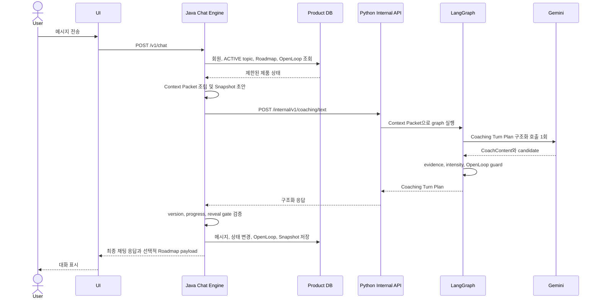
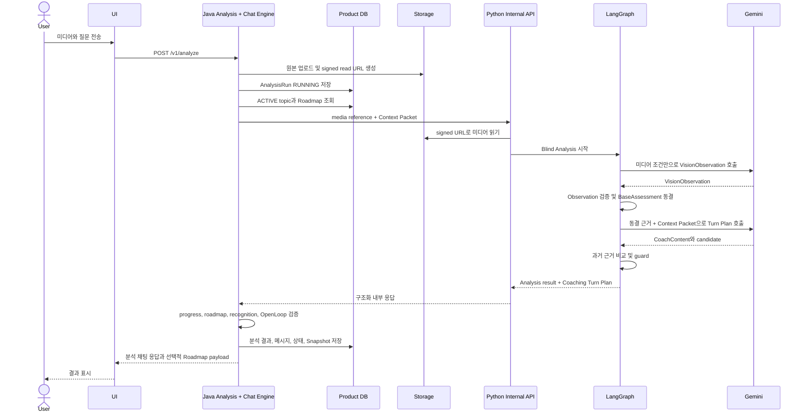
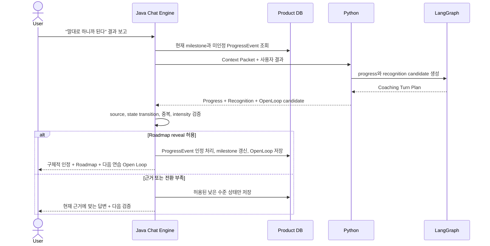
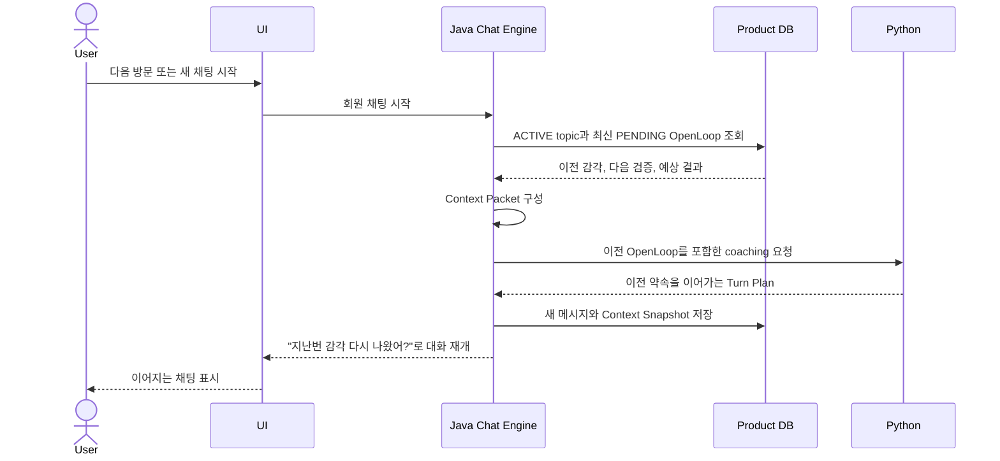
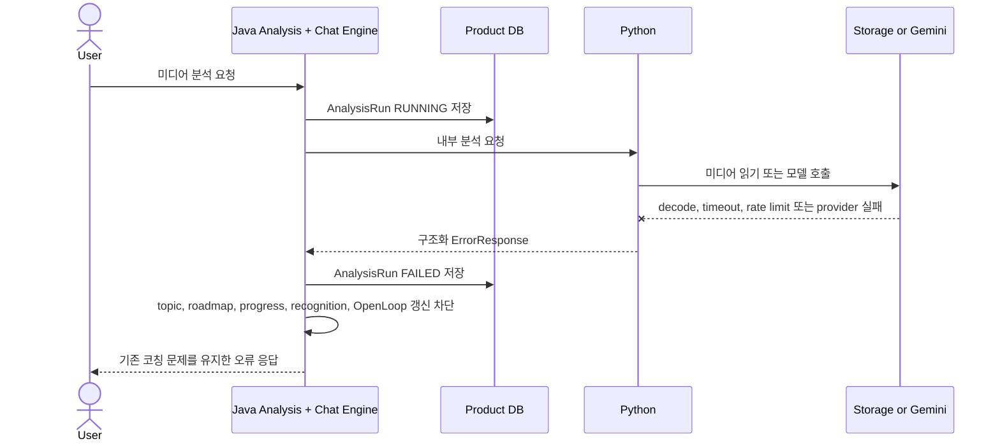

# Context-Aware Coaching Contract

> 상태: CONFIRMED — 2026-08-26
>
> 이 문서는 회원 컨텍스트, 코칭 주제, 개인 로드맵, Progress Moment와 Open Loop를 사용하는
> Java 채팅 엔진과 Python LangGraph의 제품·책임·상태 계약이다. 내부 HTTP schema의
> 기계 판독 원본은 `internal-api.openapi.yaml` 2.0.0과 `fixtures/`이며 2026-08-26에 동결했다.
> Java와 Python 구현은 이 계약을 변경하지 않고 각각 맞춘다.

## 1. 목표

회원별 대화와 분석 이력을 전부 LLM에 전달하지 않고도 다음 경험을 만든다.

- 사용자가 이전에 해결하던 코칭 문제를 기본적으로 이어간다.
- 사용자가 완성하려는 스윙이 명확해지면 개인 로드맵을 구성한다.
- 새 영상은 과거 진단과 사용자 FEEL에 끌리지 않고 먼저 독립적으로 분석한다.
- AI가 증상에서 근본 문제로 자연스럽게 대화를 다시 정의한다.
- 사용자가 실제로 발전했을 때 높은 분석 권위를 가진 AI가 구체적으로 인정한다.
- 발전을 로드맵으로 보여주고 다음 연습과 영상 업로드를 Open Loop로 연결한다.
- 채팅을 메뉴 선택 흐름으로 만들지 않고 AI가 대화를 주도한다.

## 2. 핵심 용어

### Raw Conversation

사용자와 AI의 원본 메시지 이력이다. 보존과 재현을 위한 원본이며 매 요청에 전부 넣지 않는다.

### User Context Fact

좌·우타, 장기 목표, 신체 제약, 연습 환경, 대화 선호처럼 비교적 안정적인 사용자 정보다. 사용자
명시 사실과 AI 추정을 구분한다.

### Coaching Topic

사용자가 현재 해결 중인 하나의 문제다. 증상, 다시 정의한 근본 문제, 현재 실험, 사용자의 FEEL,
결과와 상태를 가진다.

### Analysis Episode

하나의 사진·영상 분석과 연결된 OBSERVATION, 판정, FEEL, 샷 결과, 촬영 조건과 시점이다.

### Personal Swing Roadmap

사용자가 원하는 스윙에 도달하는 과정을 출발점, 근본 문제, 실험, 확인된 변화와 다음 단계로
연결한 장기 성장 상태다.

### Progress Moment

사용자가 실제로 이전 단계에서 다음 단계로 이동했음을 인정하고 로드맵을 노출하는 사건이다.

### Open Loop

발전 인정 후 대화를 완결하지 않고 다음 연습, 유지할 감각, 다음 영상과 완료 조건을 예약하는
상태다.

### Context Snapshot

한 AI 응답이 실제로 사용한 사용자 정보, 코칭 주제, 분석 에피소드와 로드맵 버전을 기록한
재현 정보다.

### Shot Result Ubiquitous Language

미스샷 명칭은 원인으로 사용하지 않는다. `접촉 결과`, `페이스 타점`, `출발 방향`, `휘어짐`,
`최종 방향`을 서로 다른 관찰 축으로 저장하고, 직접 메커니즘과 동작 원인은 그다음 단계에서
근거를 갖춰 연결한다.

#### 지면·공 접촉 결과

- `CLEAN_CONTACT`(정상 접촉): 의도한 순서와 높이로 공을 접촉한다.
- `FAT_CONTACT`(뒷땅): 공보다 지면을 먼저 접촉한다. 의도적으로 모래를 먼저 치는 벙커 샷은
  같은 결과로 분류하지 않는다.
- `CHUNK_DUFF`(심한 뒷땅): 지면 선접촉으로 클럽 속도와 거리가 크게 손실된 뒷땅이다.
- `THIN_CONTACT`(얇게 맞음): 정상보다 높은 클럽 궤도로 페이스 하단 또는 리딩엣지가 공의
  적도 부근을 접촉한다.
- `TOPPED_CONTACT`(탑볼): 리딩엣지가 공의 적도보다 확실히 위를 접촉한다.
- `AIR_SHOT`(헛스윙): 클럽과 공의 접촉이 없다.

#### 페이스 타점

- `CENTER_STRIKE`(센터 타점): 기준 중심 타점 부근에 접촉한다.
- `TOE_STRIKE`(토우 타점): 페이스 중심보다 토우 방향에 접촉한다.
- `HEEL_STRIKE`(힐 타점): 페이스 중심보다 힐 방향에 접촉한다.
- `HIGH_FACE_STRIKE`(페이스 상단 타점): 페이스 중심보다 위쪽에 접촉한다.
- `LOW_FACE_STRIKE`(페이스 하단 타점): 페이스 중심보다 아래쪽에 접촉한다.
- `SHANK_HOSEL_STRIKE`(생크): 페이스가 아닌 호젤 또는 호젤 경계에 접촉한다. 오른쪽 출발은
  흔한 결과일 수 있으나 정의 자체는 아니다.
- `SKY_CROWN_STRIKE`(뽕샷): 주로 드라이버에서 페이스 최상단 또는 크라운 인접부에 접촉한다.

`THIN_CONTACT`는 공과 클럽의 수직 접촉 결과이고 `LOW_FACE_STRIKE`는 페이스 위 타점 위치다.
둘은 같이 발생할 수 있지만 같은 용어로 합치지 않는다. `HIGH_FACE_STRIKE`도 곧바로
`SKY_CROWN_STRIKE`로 판정하지 않는다.

#### 출발 방향

저장값은 우타·좌타 해석 전의 객관적인 타깃 좌표를 사용한다.

- `START_LEFT`: 타깃보다 왼쪽으로 출발한다.
- `START_ON_LINE`: 타깃선 부근으로 출발한다.
- `START_RIGHT`: 타깃보다 오른쪽으로 출발한다.

우타의 표시명은 `START_RIGHT=Push`, `START_LEFT=Pull`이고 좌타는 반대로 표시한다.

#### 휘어짐과 크기

- `CURVE_LEFT`: 비행 중 왼쪽으로 휘어진다.
- `CURVE_NONE`: 의미 있는 좌우 휘어짐이 없다.
- `CURVE_RIGHT`: 비행 중 오른쪽으로 휘어진다.
- 휘어짐 크기는 `SMALL`, `MEDIUM`, `LARGE`로 별도 저장한다.

우타의 표시명은 오른쪽 작은 휘어짐이 `Fade`, 오른쪽 큰 휘어짐이 `Slice`, 왼쪽 작은
휘어짐이 `Draw`, 왼쪽 큰 휘어짐이 `Hook`이다. 좌타는 표시 방향을 반대로 해석한다.

#### 복합 구질

`Push-Slice`, `Pull-Slice`, `Push-Hook`, `Pull-Hook` 같은 이름을 독립 원인이나 고정 상태로
저장하지 않는다. `StartDirection + CurveDirection + CurveMagnitude`에서 표시명을 계산한다.
같은 방식으로 `Straight-Slice`, `Straight-Hook`, `Push-Fade`, `Push-Draw`, `Pull-Fade`,
`Pull-Draw`도 표현한다.

#### 공통 관찰 구조

```text
ContactSequence
ImpactLocation
StartDirection
CurveDirection
CurveMagnitude
FinishDirection
TrajectoryHeight
Confidence
EvidenceSource
```

분석 인과 순서는 다음으로 고정한다.

```text
관찰 결과
→ 직접 메커니즘
→ 전달 상태
→ 근거가 있는 동작 원인 후보
→ 필요한 추가 근거
→ 교정 한 가지
→ 검증 기준
```

`Slice → Out-to-In`, `Fat Contact → Low Point가 뒤`처럼 관찰 결과에서 원인을 바로 확정하지
않는다. 영상, 타점 자료, 런치 데이터와 사용자 보고의 근거 수준을 구분한다.

## 3. 합의된 제품 규칙

### 3.1 전체 대화와 실행 컨텍스트를 분리한다

전체 메시지는 저장하지만 요청마다 전부 불러오지 않는다. 실행 컨텍스트는 다음 순서로 필요한
정보만 조립한다.

1. 현재 질문과 사용자가 선택한 샷 조건
2. 현재 활성 코칭 주제
3. 현재 대화의 최근 메시지
4. 같은 샷·클럽 범위의 최신 검증 분석
5. 진행 중인 실험과 결과
6. 사용자 공통 정보
7. 필요한 경우에만 관련 과거 에피소드

FEEL과 OBSERVATION은 같은 사실로 합치지 않는다. FEEL은 사용자 체감이고 OBSERVATION은 해당
미디어에서 확인한 근거다.

### 3.2 코칭 문제는 기본적으로 이어간다

새 대화와 다음 방문에서도 사용자가 해결하던 문제를 기본 컨텍스트로 가져온다.

자동으로 이어갈 정보:

- 사용자가 해결하려는 문제
- 샷 유형과 클럽 범위
- 사용자 FEEL
- 현재 실험
- 사용자가 보고한 결과
- 로드맵의 현재 위치
- 이전 Open Loop

과거 영상의 OBSERVATION과 원인 판정은 새 영상의 현재 사실로 자동 적용하지 않는다.

### 3.3 문제는 이어가고 새 영상은 다시 본다

새 영상 분석은 두 단계로 처리한다.

1. Blind Analysis
   - 영상 프레임, 샷 유형, 클럽, 촬영 각도와 좌·우타만 사용한다.
   - 이전 판정, 사용자 FEEL과 현재 가설은 최초 OBSERVATION 생성에 사용하지 않는다.
2. Context Comparison
   - 현재 영상의 OBSERVATION과 기본 판정을 먼저 고정한다.
   - 그다음 과거 코칭 문제, 이전 분석과 FEEL을 비교한다.

분석 실패 시 코칭 주제와 실험은 유지하지만 새로운 영상 판정은 저장하지 않는다. 한 번의 영상
판정을 사용자 고유 패턴으로 확정하지 않는다.

### 3.4 AI가 증상에서 근본 문제로 다시 정의한다

AI가 더 우선하는 문제를 발견했을 때 선택지 버튼을 먼저 제시하지 않는다. 대화 안에서 인과를
설명하고 현재 코칭 문제를 다시 짚는다.

```text
당겨 치는 건 결과다.
당기지 않으려면 전환에서 팔이 내려올 공간이 생겨야 한다.
그러니 우리 문제를 다시 짚어보자.
지금 우선순위는 당기지 않으려는 동작이 아니라 전환 공간을 만드는 것이다.
```

AI는 여러 결함을 병렬로 나열하지 않고 현재 문제와 연결되는 가장 중요한 원인을 대화의 중심으로
삼는다.

### 3.5 한 화면의 채팅과 코칭 주제 컨텍스트를 분리한다

사용자는 하나의 채팅 화면에서 대화할 수 있지만 백엔드는 메시지와 분석을 `coaching_topic_id`로
분리한다. 고정 주제를 불러오면 해당 주제의 컨텍스트를 활성화한다.

공유 가능한 정보:

- 사용자 공통 정보
- 전체 개인 로드맵
- 명시적으로 공통 패턴으로 승격된 근거

자동으로 섞지 않을 정보:

- 다른 코칭 주제의 원본 메시지
- 다른 클럽에서 한 번만 관찰된 문제
- 종료되거나 반박된 가설

주제 전환을 위해 채팅 안에 다수의 선택지를 반복 노출하지 않는다. 사용자가 누르는 `고정 주제
띄우기`는 채팅 응답 내부의 선택 메뉴가 아니라 별도 주제 surface를 여는 명시적 행동이다. 주제를
고르면 해당 `coaching_topic_id`를 활성화하고 이후 응답은 그 주제 컨텍스트만 기본으로 사용한다.

### 3.6 로드맵은 목표가 명확할 때 생성한다

사용자가 완성하려는 스윙이 명확해졌을 때 개인 로드맵을 만든다. 고정된 교육과정이 아니라 대화,
분석과 실험 결과로 계속 갱신되는 성장 기록이다.

```text
사용자가 원하는 스윙
→ 최초 고민과 출발 상태
→ 다시 정의한 근본 문제
→ 진행한 실험
→ 사용자가 찾은 감각
→ 확인된 변화
→ 남아 있는 한 가지
→ 다음 검증과 완료 조건
```

목표가 불명확하면 로드맵을 억지로 만들지 않고 현재 코칭 주제만 이어간다.

### 3.7 로드맵은 Progress Moment에 노출한다

로드맵은 항상 노출하는 작업 목록이 아니라 사용자가 자신의 발전을 체감하게 만드는 성장 서사다.
뒤에서는 계속 갱신하되 다음 조건이 맞을 때 대화 중 자동으로 보여준다.

```text
새로운 진행 단계가 생김
AND 출발점과 현재 상태를 비교할 수 있음
AND 사용자 긍정 신호 또는 영상 변화가 있음
AND 같은 발전을 아직 인정하지 않음
AND 최근 로드맵을 반복 노출하지 않음
```

계산할 정보:

- 출발점의 존재
- 실제 진행 상태 전환
- 사용자가 수행한 실험과 결과 보고
- 사용자 체감, 결과 반복과 영상 검증의 근거 강도
- `된다`, `전보다 낫다`, `도움 됐다`, `이 느낌이 맞다` 같은 긍정 신호
- 처음 문제, 근본 문제, 행동과 결과가 연결되는 발전 서사
- 같은 발전의 이전 인정 여부와 마지막 로드맵 노출 시점

### 3.8 전문 분석기의 권위 위에서 선택적으로 인정한다

AI는 먼저 높은 분석 능력과 일관된 판단 기준을 보여줘야 한다.

- 사용자의 FEEL에 자동 동의하지 않는다.
- 증상과 원인을 구분한다.
- 확인한 것과 추정을 구분한다.
- 이전 분석과 현재 변화를 기억하고 비교한다.
- 여러 문제 중 현재 가장 중요한 하나를 고른다.
- 사용자가 핵심을 찾았을 때 무엇을 해냈는지 구체적으로 판정한다.

일반적인 감탄보다 사용자가 해낸 이해와 실행을 특정한다.

```text
이건 제대로 찾았어.
내가 말한 동작을 흉내 낸 게 아니라 왜 당기는지를 네 몸의 느낌으로 연결했잖아.
이제 이 교정을 스스로 다시 만들 수 있어.
```

```text
방금 네가 말한 “당기지 않으니까 공간이 생긴다”는 표현은 정확해.
대부분은 손을 어디로 내릴지만 찾는데, 넌 그 손이 내려올 조건을 찾았어.
이건 한 단계 넘어간 거야.
```

인정 대상:

- 원인 이해
- FEEL과 영상 근거 연결
- 제안한 실험 수행과 결과 구분
- 이전 문제의 자가 발견과 수정
- 재현 가능한 감각 발견

인정 강도:

1. 짧은 판정
2. 구체적 인정
3. 발전 선언과 로드맵 노출
4. 실제 행동을 목표 골퍼의 연습 방식과 연결하는 정체성 강화

### 3.9 발전 근거 수준을 구분한다

```text
USER_REPORTED_PROGRESS
RESULT_REPEATED
VIDEO_VERIFIED_PROGRESS
MILESTONE_COMPLETED
```

- 사용자 체감만 확인: 방향이 맞는 중요한 신호
- 샷 결과가 반복됨: 유의미한 변화
- 영상에서도 확인됨: 해당 단계를 넘어온 변화

`거의 해결됐다`는 표현은 근본 문제가 확인되고, 사용자가 맞는 감각을 찾았으며, 결과 반복 또는
영상 변화가 있고, 남은 수정이 한 가지로 좁혀졌을 때 사용한다.

### 3.10 Progress Moment는 Open Loop로 끝낸다

발전을 인정하고 로드맵을 보여준 뒤 대화를 완결하지 않는다. 다음 연습과 검증을 자연스럽게
예약한다.

```text
정확한 분석
→ 사용자가 해낸 변화 인정
→ 로드맵으로 이동 거리 확인
→ 거의 해결될 문제와 남은 한 가지 제시
→ 다음 연습 또는 영상 업로드 예약
```

```text
이건 제대로 찾았어.
처음에는 당겨 치는 결과만 보였는데, 지금은 당기지 않아도 되게 만드는 전환 공간까지
네 느낌으로 연결했잖아. 이 정도면 이 문제의 핵심은 거의 잡은 거야.

다음 연습은 언제야?
그때까지 이 감각을 유지해보자. 다음 영상에서는 이 느낌을 그대로 살리고 임팩트 직전까지
공간이 유지되는지만 볼 거야. 그것까지 잡히면 당김 문제는 거의 고쳐진다고 봐도 돼.
```

다음 방문은 저장된 Open Loop로 시작한다.

```text
지난번에 찾은 전환 공간 느낌, 연습장에서 다시 나왔어?
```

```text
이번 영상은 지난번 감각이 우연이었는지 네 동작으로 굳은 건지 보면 돼.
```

### 3.11 대화는 의미 있는 사건으로 갱신한다

체류시간을 위해 의미 없는 질문을 반복하지 않는다. 다음 사건이 생길 때 현재 코칭 문제의 인과와
연결해 대화를 새롭게 전개한다.

- 새 영상 분석 완료
- 사용자가 연습 결과를 보고함
- 기존 가설과 다른 현상 발견
- 현재 과제의 개선 신호 발생
- 다음 근본 문제 발견
- 로드맵 단계 전환
- 이전 Open Loop의 검증 결과 도착

## 4. 확정 도메인 상태

이 목록은 구현이 제공해야 하는 도메인 상태다. 물리 DB table 분할은 Java schema 설계 task에서
정하되 lifecycle과 소유권은 이 계약을 따른다.

### UserContextFact

- 적용 범위: global, shot profile, club group
- 값과 출처
- 사용자 명시, 영상 관찰, 모델 가설 구분
- 유효 시점과 대체된 시점

### CoachingTopic

- 사용자 문제 표현
- 현재 근본 문제
- 샷·클럽 범위
- 현재 가설과 근거
- 진행 중인 실험
- carry-forward FEEL
- 상태: `ACTIVE`, `PAUSED`, `RESOLVED`, `SUPERSEDED`

### Roadmap

- 사용자가 원하는 스윙
- 출발 상태
- 현재 단계
- 생성·갱신 시점
- 활성 상태와 version

### RoadmapMilestone

- 해결할 근본 문제
- 진입 조건
- 진행 상태
- 완료 조건
- 연결된 코칭 주제와 근거

### ProgressEvent

- 진행 상태 전환
- 근거 수준
- 연결된 메시지와 분석 에피소드
- 이미 사용자에게 인정했는지 여부

### RecognitionEvent

- 인정 대상
- 인정 강도: `ACKNOWLEDGEMENT`, `SPECIFIC_RECOGNITION`, `PROGRESS_DECLARATION`,
  `IDENTITY_CONNECTION`
- 근거 ID
- 로드맵 영향
- 마지막 같은 주제 인정 시점

### OpenLoop

- `carry_forward_feel`
- `next_single_change`
- `next_verification`
- `completion_condition`
- `next_practice_at`
- `next_upload_expected`
- `predicted_result`
- 상태: `PENDING`, `FULFILLED`, `REPLACED`, `CANCELLED`

### ContextSnapshot

- 응답이 사용한 사용자 사실 ID와 version
- 활성 코칭 주제 ID
- 분석 에피소드 ID
- 로드맵과 Open Loop version
- 최근 메시지 범위
- 생성된 응답 또는 분석 실행 ID

## 5. 요청별 처리 흐름

### 5.1 텍스트 대화

```text
사용자 메시지 수신
→ Java가 회원과 활성 코칭 주제 조회
→ 관련 최근 대화·로드맵·Open Loop로 Context Packet 구성
→ Python LangGraph가 현재 발화와 컨텍스트 해석
→ 근본 문제 재정의·진행·인정·Open Loop 후보 생성
→ Java가 기존 상태와 근거를 검증
→ 상태 갱신과 최종 채팅 응답 조립
→ Context Snapshot 저장
```

### 5.2 사진·영상 분석 대화

```text
미디어와 질문 수신
→ Java가 분석 실행과 미디어를 저장
→ Python이 과거 진단 없이 Blind Analysis
→ OBSERVATION과 BaseAssessment 고정
→ LangGraph가 현재 근거와 Context Packet 비교
→ CoachContent와 상태 변경 후보 생성
→ Java가 분석 결과와 코칭 상태를 저장
→ Progress Moment·로드맵 노출·Open Loop 결정
→ 최종 채팅 응답과 Context Snapshot 저장
```

## 6. 책임분리

## 6.1 Java/Spring Boot Chat Engine

### 소유 책임

- 회원과 전체 원본 대화 저장
- 사용자 공통 정보와 범위별 Context Fact 저장
- 코칭 주제의 생성, 활성화, 일시정지와 종료
- 분석 에피소드와 근거 수준 저장
- 개인 로드맵과 milestone lifecycle 관리
- Open Loop 저장과 다음 방문 복원
- 요청별 Context Packet 검색·조립
- LangGraph가 제안한 상태 변경의 검증과 version 갱신
- Progress Moment와 로드맵 노출의 결정적 gate 계산
- 같은 발전의 중복 인정 방지
- Python의 구조화된 내용을 이용한 최종 사용자 응답 조립
- Context Snapshot과 판단 재현 정보 저장
- 회원 탈퇴·삭제 시 원본과 파생 컨텍스트 삭제 정책 수행

### 소유하지 않는 책임

- 영상 프레임의 직접 판정
- Gemini provider 호출
- OBSERVATION 생성
- LangGraph 분석 노드 실행
- 사용자 발화에서 의미 후보를 자유형으로 추론하는 작업

## 6.2 Python/FastAPI LangGraph Coaching Orchestrator

### 소유 책임

- 현재 발화의 코칭 의도 해석
- 새 미디어의 Blind Analysis 순서 보장
- OBSERVATION과 BaseAssessment 동결
- 현재 근거와 전달받은 과거 컨텍스트 비교
- 증상에서 근본 문제로 이어지는 인과 구성
- 코칭 주제 재정의 후보 생성
- 사용자 발화의 Progress Signal 후보 추출
- Roadmap Update Candidate 생성
- Recognition Candidate와 표현 내용 생성
- Open Loop Candidate와 다음 검증 내용 생성
- 확장된 구조화 CoachContent 반환
- FEEL, OBSERVATION, MEASUREMENT 경계 검증

### 소유하지 않는 책임

- 회원 DB 직접 조회
- 전체 메시지 검색
- 제품 DB와 Supabase Storage 쓰기
- 로드맵·코칭 주제·Open Loop의 직접 확정 또는 덮어쓰기
- 같은 발전의 이전 인정 여부를 자체 기억으로 판단
- 사용자 탈퇴·보관 정책 수행

## 6.3 UI

### 소유 책임

- 채팅 중심 흐름 유지
- 현재 활성 고정 주제를 방해 없이 표시
- Progress Moment의 로드맵 카드 표시
- 과거 발전과 현재 단계 표현
- 다음 연습·영상 Open Loop를 대화 흐름 안에서 표시
- 주제를 전환해도 다른 주제의 맥락이 섞인 것처럼 보이지 않게 표현

### 제한

- 코칭 중 다수의 선택 버튼을 기본 대화 방식으로 사용하지 않는다.
- 로드맵을 상시 과제 목록처럼 강제 노출하지 않는다.
- 내부 근거 상태명과 분석 schema를 사용자에게 그대로 보여주지 않는다.

## 7. Java → Python 입력 계약: Context Packet

```text
request_context
  user_message
  user_feel
  selected_shot_context
  media_presence

active_coaching_topic
  user_problem
  root_problem
  scope
  active_hypothesis
  current_experiment
  carry_forward_feel

roadmap_context
  target_swing
  current_milestone
  completed_milestones
  next_completion_condition

recent_dialogue

relevant_analysis_episodes
  observation_summary
  evidence_level
  captured_at
  scope

relevant_user_context_facts
  statement
  evidence_level
  scope
  source_episode_ids

pending_open_loop
  next_single_change
  next_verification
  predicted_result

recognition_context
  unrecognized_progress_events
  recently_recognized_topics
  last_roadmap_reveal_at
```

Blind Analysis 노드는 이 전체 객체를 받아도 과거 코칭 필드를 읽지 못하도록 graph state와 node
입력을 분리한다.

## 8. Python → Java 출력 계약: Coaching Turn Plan

```text
coach_content
  direct_answer
  causal_chain
  evidence_boundary
  single_change
  verification

problem_reframe_candidate
  previous_problem
  proposed_root_problem
  causal_explanation
  evidence_references

coaching_topic_candidate
  action
  scope
  title

roadmap_update_candidates
  target_or_milestone
  proposed_transition
  evidence_references

progress_candidate
  progress_level
  user_signal
  evidence_references

recognition_candidate
  target
  proposed_intensity
  recognition_content

open_loop_candidate
  carry_forward_feel
  next_single_change
  next_verification
  completion_condition
  predicted_result
  question
```

Candidate는 제안이다. Java가 기존 상태, source ID와 lifecycle 규칙을 확인한 뒤 적용 여부를
결정한다.

## 9. 확정 상태·검색·노출 규칙

### 9.1 식별과 version

- 모든 CoachingTopic, Roadmap, Milestone, ProgressEvent, RecognitionEvent, OpenLoop와
  ContextSnapshot은 UUID를 가진다.
- 갱신 가능한 aggregate는 양의 정수 `version`을 가진다.
- Java는 전달한 version과 현재 version이 다르면 Python의 update candidate를 적용하지 않고 현재
  상태로 다시 조립한다.
- 같은 `request_id`는 상태 변경을 한 번만 적용한다.

### 9.2 로드맵 생성 조건

로드맵은 다음 세 항목이 모두 있을 때만 생성한다.

1. 적용 범위: shot profile과 club 또는 club group
2. 사용자가 원하는 샷·동작 결과
3. 해당 결과를 만들겠다는 사용자의 명시적 의도

`골프를 잘 치고 싶다`처럼 범위와 결과가 없는 발화는 로드맵을 생성하지 않는다. 목표 명확성은
Python이 candidate로 제안하고 Java가 현재 사용자 발화와 선택 컨텍스트를 확인해 확정한다.

### 9.3 코칭 주제 routing

- 현재 발화가 같은 샷 범위와 같은 사용자 문제를 이어가면 현재 ACTIVE topic을 유지한다.
- 같은 증상의 원인이 새 근거로 다시 정의되면 새 topic을 만들지 않고 root problem version을
  갱신한다.
- 다른 shot profile 또는 club group의 독립 문제면 새 topic을 만들고 기존 ACTIVE topic은
  PAUSED로 전환한다.
- 사용자가 고정 주제를 불러오면 해당 topic을 ACTIVE로 만들고 이전 ACTIVE topic은 PAUSED로
  전환한다.
- 한 회원에게 ACTIVE topic은 동시에 하나만 허용한다.

### 9.4 Context Packet 선택 한도

MVP의 프로젝트 고정값은 다음과 같다.

- 현재 topic 최근 메시지: 최대 12개
- 관련 AnalysisEpisode: 최대 3개
- UserContextFact: 최대 12개
- 완료 milestone 요약: 최대 10개
- PENDING OpenLoop: 현재 topic의 최신 1개

Java는 먼저 user, topic, shot profile과 club group으로 필터한 뒤 최신성과 evidence level을 적용한다.
Vector 검색은 이 계약 범위에 포함하지 않는다.

### 9.5 공통 패턴 승격

- 한 AnalysisEpisode의 관찰은 해당 scope에만 적용한다.
- 서로 다른 촬영의 독립 episode 2개 이상에서 같은 category가 반복돼야 반복 관찰로 승격할 수
  있다.
- 서로 다른 club group 2개 이상에서 반복 검증된 관찰만 global 후보가 될 수 있다.
- Python은 승격 candidate만 만들며 Java가 source episode 수와 scope를 검증한다.

위 숫자는 2026-08-26 MVP 운영 규칙이며 실제 사용자 데이터 검증 후 별도 계약 변경으로 조정한다.

### 9.6 상태 전환

#### CoachingTopic

| 현재 | 사건 | 다음 |
|---|---|---|
| `ACTIVE` | 다른 topic 활성화 | `PAUSED` |
| `PAUSED` | 사용자 고정 주제 불러오기 또는 관련 대화 재개 | `ACTIVE` |
| `ACTIVE` | 완료 조건 충족 | `RESOLVED` |
| `ACTIVE` 또는 `PAUSED` | 중복 topic 병합 또는 더 정확한 topic으로 대체 | `SUPERSEDED` |

#### RoadmapMilestone evidence level

| 현재 또는 낮은 단계 | 새 근거 | 다음 |
|---|---|---|
| 없음 | 사용자가 개선 체감 보고 | `USER_REPORTED_PROGRESS` |
| `USER_REPORTED_PROGRESS` | 샷 결과 반복 보고 | `RESULT_REPEATED` |
| 이전 단계 | 새 영상에서도 개선 확인 | `VIDEO_VERIFIED_PROGRESS` |
| 이전 단계 | milestone별 completion condition 충족 | `MILESTONE_COMPLETED` |

영상 근거가 먼저 도착하면 중간 단계를 순서대로 거칠 필요 없이 `VIDEO_VERIFIED_PROGRESS`로
전환할 수 있다. 낮은 근거의 새 발화가 높은 근거 상태를 하향하지 않는다.

#### OpenLoop

| 현재 | 사건 | 다음 |
|---|---|---|
| 없음 | 다음 검증 계획 확정 | `PENDING` |
| `PENDING` | 사용자가 결과 또는 미디어 제출 | `FULFILLED` |
| `PENDING` | 더 최신 검증 계획 생성 | `REPLACED` |
| `PENDING` | topic 해결·폐기 또는 사용자 취소 | `CANCELLED` |

topic당 PENDING OpenLoop는 하나만 허용하고 시간만으로 자동 만료시키지 않는다.

### 9.7 Progress Moment와 Recognition gate

- Recognition은 ProgressEvent 하나당 한 번만 생성한다.
- 한 turn에서 사용자에게 노출하는 RecognitionEvent는 최대 하나다.
- `USER_REPORTED_PROGRESS`만으로 영상 개선을 선언하지 않는다.
- Roadmap 전체 노출은 milestone state transition과 사용자 긍정 신호 또는 영상 개선 근거가 함께
  있고, 해당 milestone version을 이전에 노출하지 않았을 때만 허용한다.
- Recognition 내용은 Java가 허용한 intensity를 초과할 수 없다.
- Progress Moment 응답에는 PENDING OpenLoop를 하나 포함한다.

### 9.8 모델 호출 예산

- 텍스트 turn은 Coaching Turn Plan 생성을 위한 Gemini 호출 최대 1회다.
- 미디어 turn은 VisionObservation 호출 1회와 Coaching Turn Plan 호출 1회, 총 최대 2회다.
- LangGraph node를 나눴다는 이유로 provider 호출을 추가하지 않는다.
- state routing, version check, evidence promotion과 reveal gate는 결정적 코드로 실행한다.
- timeout, 429와 5xx 자동 재시도 금지는 기존 Java–Python boundary를 따른다.

### 9.9 최종 응답 조립 순서

Java는 허용된 필드만 사용해 다음 순서로 사용자 응답을 조립한다.

```text
직접 답변
→ 필요한 경우 근본 문제 재정의
→ 허용된 Recognition
→ 허용된 경우 Roadmap card payload
→ Open Loop
```

Progress Moment 직후 다른 결함을 추가로 나열하지 않는다. 내부 schema명, evidence enum과 후보
상태는 사용자 화면에 그대로 노출하지 않는다.

## 10. 시퀀스 다이어그램

### 10.1 텍스트 채팅



### 10.2 사진·영상 분석 채팅



### 10.3 Progress Moment와 로드맵 노출



### 10.4 다음 방문의 Open Loop 복원



### 10.5 분석 실패 시 상태 보존



## 11. Java Chat Engine 작업 목록

### J1. 컨텍스트 도메인 계약

- UserContextFact, CoachingTopic, Roadmap, Milestone, ProgressEvent, RecognitionEvent, OpenLoop와
  ContextSnapshot의 책임과 lifecycle 확정
- 사용자 명시 사실, FEEL, OBSERVATION과 가설의 source type 확정
- 범위와 version·supersede 규칙 확정

### J2. 저장 schema와 repository

- 기존 conversation, message, swing session과 analysis run에 연결할 schema 설계
- 코칭 주제, 로드맵, 진행 사건과 Open Loop 저장
- 전체 대화 삭제 시 파생 컨텍스트 삭제 경로 정의

### J3. Context Retrieval Engine

- 현재 회원과 활성 코칭 주제 조회
- 같은 샷·클럽 범위의 최신 검증 근거 조회
- 최근 대화와 관련 에피소드의 제한된 선택
- Context Packet 조립과 크기 제한
- 응답별 Context Snapshot 생성

### J4. Coaching Topic Lifecycle

- 기본 문제 이어가기
- 대화 중 문제 재정의 후보 적용
- 한 화면에서 여러 주제를 분리
- active, paused, resolved와 superseded 전환

### J5. Roadmap Engine

- 목표가 명확해졌다는 후보 검증
- 개인 로드맵 생성과 version 관리
- milestone 생성·전환·완료 조건 관리
- 현재 코칭 주제와 로드맵 연결

### J6. Progress and Recognition Gate

- Progress Candidate를 기존 상태와 비교
- 근거 수준 전환 검증
- 같은 발전의 중복 인정 방지
- 로드맵 노출 조건과 신선도 계산
- 인정 강도 허용 범위 결정

### J7. Open Loop Engine

- 다음 연습, 유지할 감각과 검증 항목 저장
- 기존 Open Loop 완료·대체·만료 처리
- 다음 방문에서 이어갈 Open Loop 선택
- 실제 결과와 predicted result 비교

### J8. Chat Response Assembly

- CoachContent, Recognition Candidate, Roadmap 상태와 Open Loop를 하나의 자연스러운 응답으로 조립
- 문제 재정의와 다음 행동이 메뉴가 아닌 대화로 이어지게 구성
- Progress Moment 직후 로드맵 카드 payload 포함

### J9. 감사와 삭제

- 어떤 컨텍스트가 응답에 사용됐는지 재현
- 잘못된 Context Fact와 로드맵 상태 수정·supersede
- 회원 삭제 시 원본 메시지, 요약, 분석 근거, 로드맵과 snapshot 삭제

### J10. 테스트

- 컨텍스트 범위 격리
- 같은 발전 중복 인정 차단
- 근거 없는 milestone 전환 차단
- Open Loop 복원
- 주제 전환 시 컨텍스트 혼합 방지
- Java → Python fixture contract
- 공개 채팅과 분석 API `curl` integration

## 12. Python LangGraph 작업 목록

### P1. Graph State와 구조화 출력 확장

- Context Packet 입력 schema
- Coaching Turn Plan 출력 schema
- 후보 객체별 validation rule
- 기존 CoachContent와의 호환 또는 migration 범위 결정

### P2. Blind Analysis 경계 강화

- vision observation node가 과거 판정, FEEL과 로드맵을 읽지 못하게 입력 state 분리
- OBSERVATION과 BaseAssessment 동결 후에만 context comparison 허용
- 분석 실패 시 상태 후보를 생성하지 않는 guard

### P3. Context Comparison Node

- 현재 OBSERVATION과 같은 범위의 과거 분석 비교
- 반복 확인, 반박, 개선과 비교 불가 후보 생성
- 다른 클럽·주제 근거의 자동 전이 차단

### P4. Root Problem Reframe Node

- 사용자 증상과 현재 관찰을 인과로 연결
- 가장 중요한 근본 문제 하나를 제안
- 선택지 없이 대화로 다시 짚을 설명 생성

### P5. Coaching Topic Candidate Node

- 현재 문제 유지, 재정의, 해결과 새 주제 후보 판정
- 자유로운 추론 결과를 구조화 candidate로 제한

### P6. Roadmap Progress Detection Node

- 목표 명확성 후보 감지
- 사용자 체감, 결과 반복과 영상 개선 신호 구분
- milestone 전환 후보와 근거 reference 생성
- 이미 확정된 진행 상태를 임의로 재작성하지 않음

### P7. Recognition Planning Node

- 사용자가 무엇을 이해하거나 실행했는지 특정
- 근거 수준에 맞는 인정 내용 생성
- 전문 분석기의 판단 권위를 유지하는 표현 생성
- Java가 허용한 강도 이상으로 발전을 선언하지 않는 guard

### P8. Open Loop Planning Node

- 다음까지 유지할 감각
- 다음에 수정할 한 가지
- 다음 영상에서 확인할 내용
- 완료 조건과 예상 결과
- 다음 연습 또는 영상 업로드로 이어지는 자연스러운 질문 생성

### P9. Coaching Content Composition

- 직접 답변, 문제 재정의, 인정, 로드맵 진행과 Open Loop를 한 대화 흐름으로 구성
- 내부 schema명, 보고서 제목과 선택 메뉴 노출 방지
- Progress Moment 뒤에 다음 결함을 연속 나열하지 않음

### P10. Graph Guard와 테스트 fixture

- FEEL이 OBSERVATION에 섞이지 않는 fixture
- 과거 오판이 새 Blind Analysis를 유도하지 않는 fixture
- 사용자 긍정 발화를 영상 개선으로 과장하지 않는 fixture
- 문제 재정의 인과 예시 fixture
- Progress Moment와 Open Loop 출력 fixture
- LangGraph node별 단위 테스트와 내부 API contract test

## 13. UI 후속 작업 목록

백엔드와 LangGraph 계약 확정 후 별도 기능 변경으로 진행한다.

- 현재 활성 코칭 주제 표시
- 고정 주제 불러오기와 맥락 전환 표현
- Progress Moment 로드맵 카드
- 출발점, 근본 문제, 실험, 현재 변화와 다음 검증 표현
- 다음 연습·업로드 Open Loop 표시
- 주제별 메시지 타임라인 표현 방식

## 14. 구현 순서

구조 변경과 사용자 기능 변경을 섞지 않는다.

1. 도메인 용어와 Java–Python Context Packet·Coaching Turn Plan 계약
2. 계약 fixture와 상태 전환 UAT
3. Java context domain과 저장 schema
4. Java Context Retrieval과 Snapshot
5. Python LangGraph state·node 확장
6. Java Progress·Recognition·Open Loop engine
7. Java 최종 응답 조립 연결
8. 텍스트 채팅 integration
9. 미디어 Blind Analysis·Context Comparison integration
10. UI 고정 주제·로드맵·Open Loop 기능

## 15. 완료 판정 기준

- 새 대화에서도 활성 코칭 문제와 Open Loop가 이어진다.
- 전체 메시지를 넣지 않아도 이전 목표·실험·결과를 정확히 참조한다.
- 새 영상 OBSERVATION이 과거 판정과 FEEL 없이 생성된다.
- 드라이버와 아이언 코칭 주제가 자동으로 섞이지 않는다.
- AI가 증상에서 근본 문제로 인과를 연결해 대화를 다시 짚는다.
- 사용자 체감만으로 영상 개선 milestone을 완료하지 않는다.
- 실제 progress transition이 있을 때만 로드맵을 노출한다.
- 같은 발전을 반복해서 인정하지 않는다.
- Progress Moment가 다음 연습·영상 Open Loop로 이어진다.
- 다음 방문에서 이전 Open Loop를 자연스럽게 복원한다.
- 각 응답이 사용한 Context Snapshot을 추적할 수 있다.
- Java와 Python fixture contract 및 관련 `curl` integration이 통과한다.

## 16. 후속 개선 아젠다

아래 항목은 오늘 확정한 코칭 규약과 구현 착수의 차단 조건이 아니다.

1. 주제 전환 상태를 UI에서 시각화하는 방식
2. 관계 깊이에 따른 인정 표현의 세부 톤
3. 로드맵 공개 범위와 변경 이력 표시 방식
4. 사용자가 컨텍스트와 로드맵을 직접 정정하는 방식
5. 컨텍스트 보관·삭제 기간
6. Vector DB 도입 기준
7. 고정 수치와 Progress Moment 노출 규칙의 운영 데이터 기반 재조정

## 17. 현재 범위에서 하지 않을 것

- 원본 대화 전체를 매 요청에 전달
- 모든 메시지를 즉시 Vector DB에 임베딩
- 한 번의 영상 판정을 사용자 고유 패턴으로 확정
- LangGraph가 회원 DB와 로드맵을 직접 수정
- 여러 선택 버튼으로 코칭 방향을 매번 사용자에게 결정하게 함
- Progress Moment 없이 로드맵을 반복 상시 노출
- 구조 변경과 UI 기능 변경의 동시 구현
